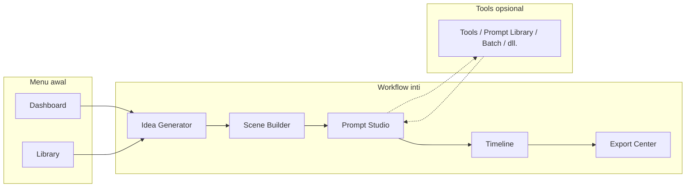
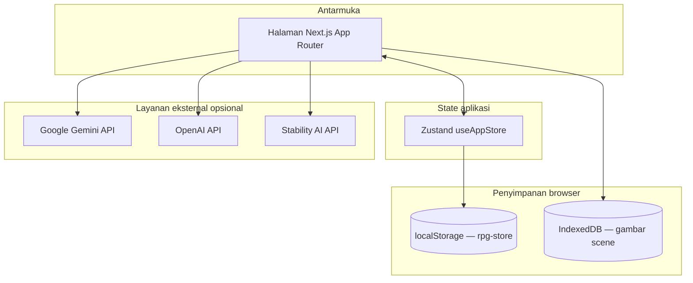
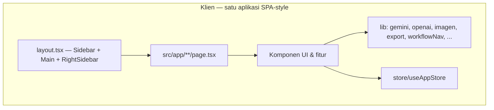

# RestoreGen — Restoration Prompt Generator

Aplikasi web **Next.js** untuk merancang konten restorasi (furniture, bangunan, kendaraan, dll.): dari ide awal, susunan adegan (scene), prompt gambar & video, timeline, hingga ekspor. Semua berjalan di **browser**; data proyek disimpan **lokal** (localStorage + IndexedDB untuk gambar besar).

---

## Ringkasan

| Aspek | Penjelasan |
|--------|------------|
| **Tujuan** | Membantu kreator membuat **image prompt** & **video prompt** yang konsisten per scene, dengan mode konten **restorasi workshop** atau **pembangunan kabin (timelapse)**. |
| **Alur inti** | Ide → Scene → Prompt Studio → Timeline → Export (bisa dilengkapi tools tambahan). |
| **AI** | Google **Gemini** (teks/ide), **OpenAI** sebagai cadangan, **Stability AI** untuk gambar; kunci API diatur di **Pengaturan** (disimpan di perangkat). |
| **State** | **Zustand** + persist; gambar scene di **IndexedDB** agar tidak memenuhi quota localStorage. |

---

## Fitur utama

- **Dashboard** — ringkasan proyek aktif, progres scene, pintasan ke workflow.
- **Library** — daftar proyek & **template** (simpan/salin struktur scene).
- **Workflow 5 langkah** (satu jalur disarankan):
  1. **Idea Generator** — input objek, kondisi awal, gaya visual → saran judul & daftar nama scene.
  2. **Scene Builder** — susun/edit scene, urutan, deskripsi.
  3. **Prompt Studio** — generate/sunting **image prompt** & **video prompt** per scene; opsi generate gambar (Stability).
  4. **Timeline** — urutan visual scene (drag-and-drop).
  5. **Export Center** — unduh gambar (ZIP) & teks prompt.
- **Tools & lanjutan** — alat di luar jalur wajib:
  - Prompt Library, Batch Generate, Prompt Translator, Prompt Enhancer, Storyboard, Video Script.
- **Pengaturan** — banyak API key (Gemini/OpenAI dengan rotasi), Stability, model Gemini, statistik pemakaian lokal, zona bahaya reset data.

---

## Peta halaman (navigasi)

```
Menu:          Dashboard · Library
Workflow:      Idea Generator → Scene Builder → Prompt Studio → Timeline → Export
Lanjutan:      Tools & lanjutan (Prompt Library, Batch, Translator, Enhancer, Storyboard, Video Script)
Sistem:        Pengaturan
```

---

## Diagram alur kerja (workflow utama)

Alur disarankan **berurutan**; tools tambahan bisa dipakai kapan saja.



---

## Diagram alur data & penyimpanan

Data mengalir dari input pengguna ke store, lalu ke penyimpanan browser.



**Catatan:** `imageData` besar tidak diserialkan penuh ke localStorage; disinkronkan via **IndexedDB** (`src/lib/imageStorage.ts`).

---

## Arsitektur teknis (ringkas)



- **Framework:** Next.js 16 (App Router), React 19, TypeScript.
- **Styling:** Tailwind CSS v4, komponen UI (shadcn-style), ikon Lucide.
- **Drag & drop timeline/scene:** `@dnd-kit`.
- **Ekspor ZIP:** `jszip` dimuat dinamis saat unduh (`src/lib/export.ts`).

---

## Menjalankan secara lokal

```bash
npm install
npm run dev
```

Buka [http://localhost:3000](http://localhost:3000) — root mengarahkan ke `/dashboard`.

```bash
npm run build    # produksi
npm run start    # setelah build
npm run dev:webpack   # opsi: dev dengan Webpack (bukan Turbopack)
```

---

## Variabel lingkungan & API

- Kunci **Gemini**, **OpenAI**, **Stability** bisa dimasukkan lewat halaman **Pengaturan** (disimpan lokal), tanpa `.env` wajib untuk pengembangan dasar.
- Untuk **deploy** (mis. Vercel), jika nanti Anda memindahkan secret ke server, tambahkan env di dashboard hosting — file `.env*` tidak di-commit (lihat `.gitignore`).

---

## Deploy ke Vercel

1. Push repo ke GitHub.
2. Di [Vercel](https://vercel.com): **Import Project** → pilih repository → framework **Next.js** terdeteksi otomatis.
3. Deploy; sesuaikan **Environment Variables** jika menggunakan API sisi server nanti.

---

## Lisensi & kontribusi

Proyek ini untuk penggunaan sesuai kebijakan pemilik repository. Untuk pertanyaan atau perbaikan, gunakan **Issues** / **Pull Requests** di GitHub.

---

## Referensi cepat file penting

| Area | Lokasi |
|------|--------|
| Urutan workflow | `src/lib/workflowNav.ts` |
| State global | `src/store/useAppStore.ts` |
| Tipe domain | `src/types/index.ts` |
| Gambar besar | `src/lib/imageStorage.ts` |
| Layout shell | `src/app/layout.tsx` |
